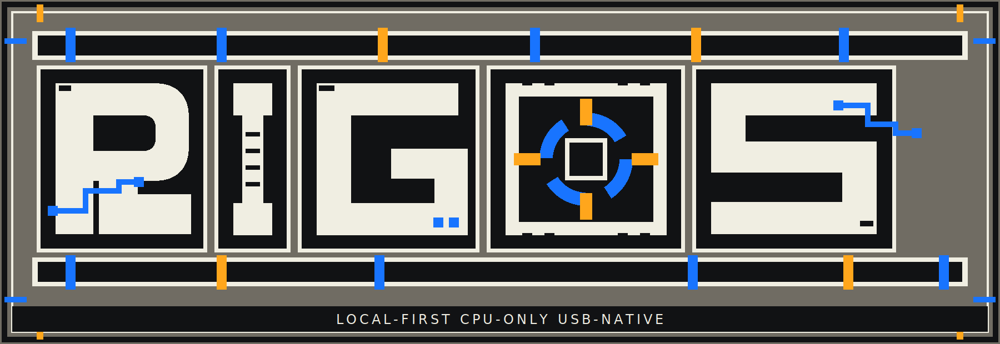
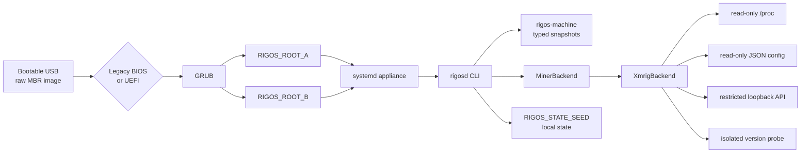

<p align="center">
  <a href="https://github.com/Deadbytes101/RIGOS">
    
  </a>
</p>

<p align="center">
  <a href="#status"></a>
  <a href="docs/product-contract.md"></a>
  <a href="docs/usb-image-build.md"></a>
  <a href="docs/product-contract.md"></a>
</p>

<p align="center">
  <a href="docs/architecture.md">Architecture</a>
  &nbsp;·&nbsp;
  <a href="docs/usb-image-build.md">USB image</a>
  &nbsp;·&nbsp;
  <a href="docs/product-contract.md">Product contract</a>
  &nbsp;·&nbsp;
  <a href="docs/physical-validation-evidence.md">Validation</a>
</p>

---

RIGOS is a local-first Linux mining operating system delivered as a bootable USB image.
The machine remains the authority: no RIGOS account, activation service, cloud owner or
remote kill-switch is required.

<a id="status"></a>
STATUS
------

```text
BUILD       RIGOS 0.0.4-alpha.5
TARGET      CPU-only mining appliance
BOOT        raw MBR disk image
FIRMWARE    Legacy BIOS + removable-media UEFI
RECOVERY    stateless ISO
STATE       local persistent partition
```

SYSTEM CONTRACT
---------------

```text
OS LICENSE COST   0          WORKER LIMIT   NONE
MONTHLY FEE       0          ACCOUNT        NOT REQUIRED
CLOUD FEE         0          ACTIVATION     NONE
RIGOS DEV FEE     0          FORCED POOL    NONE
```

Electricity, Internet access, hardware, pool fees and third-party miner fees remain
external costs. The codebase contains no billing, entitlement, trial, balance or
payment-dependent miner control.

DISK IMAGE
----------

```text
+---+----------------------+----------------------------+
| 1 | EFI_SYSTEM           | FAT32 / active             |
| 2 | RIGOS_ROOT_A         | primary appliance root     |
| 3 | RIGOS_ROOT_B         | alternate appliance root   |
| 4 | RIGOS_STATE_SEED     | local persistent state     |
+---+----------------------+----------------------------+
```

The recovery ISO is stateless and does not grow the state partition.

BOOT / CONTROL PATH
-------------------



VERIFY / INSPECT
----------------

```bash
./scripts/verify.sh

cargo run -p rigosd -- machine inspect
cargo run -p rigosd -- machine inspect --json
cargo run -p rigosd -- miner inspect --json
cargo run -p rigosd -- doctor --json
```

<details>
<summary><b>ALPHA HISTORY</b></summary>

```text
0.0.4-alpha.1  GPT image failed Dell Legacy BIOS before GRUB
0.0.4-alpha.2  MBR image reached GRUB ROOT_A systemd and password setup
0.0.4-alpha.3  fixed console order but kept the first boot screen hidden
0.0.4-alpha.4  keeps the first boot screen on tty and captures answers separately
0.0.4-alpha.5  adds local rig profiles and portable XMRig Flight Sheets
```

Alpha five is isolated on its development branch. Alpha four physical-state
validation remains separate.

</details>

DOCUMENTS
---------

[Architecture](docs/architecture.md) ·
[USB image build](docs/usb-image-build.md) ·
[Product contract](docs/product-contract.md) ·
[Pool contract](docs/pool-contract.md) ·
[Release claims](docs/release-claims.md) ·
[Physical evidence policy](docs/physical-validation-evidence.md)
