# RIGOS

CPU-only, pool-neutral, USB-native, local-first Linux mining operating system.

```text
NO CLOUD. NO ACCOUNT. NO SUBSCRIPTION. NO WORKER LIMIT.
NO LICENSE SERVER. NO RIGOS DEV FEE. NO FORCED POOL.

FLASH IT. BOOT IT. MINE.
```

```text
READ THE MACHINE.
UNDERSTAND THE MINER.
ESTABLISH THE CONTRACT.
MUTATE NOTHING.
```

`v0.0.1` is the observation contract. It reads Linux machine state and an existing local XMRig process; it does not start, stop, signal, configure, supervise, download, or update a miner. USB appliance construction and local authority remain later milestones.

```mermaid
flowchart LR
    USB["RIGOS USB"] --> Firmware["Legacy BIOS / UEFI"]
    Firmware --> Boot["GRUB"]
    Boot --> Select["Select ROOT_A or ROOT_B"]
    Select --> Root["Read-only RIGOS Root"]
    Root --> State["Mount RIGOS_STATE"]
    State --> Network["Network Initialization"]
    Network --> Agent["rigosd"]
    Agent --> Policy["Load Last-Known-Good Policy"]
    Policy --> Miner["XMRig"]
    Miner --> Pool["Compatible Stratum Pool"]
```



## Commands

```bash
cargo run -p rigosd -- machine inspect
cargo run -p rigosd -- machine inspect --json
cargo run -p rigosd -- miner inspect --json
cargo run -p rigosd -- doctor --json
./scripts/verify.sh
```

Release artifacts expose `rigosd` and the canonical `rigosctl` symlink from one executable, preventing daemon/CLI implementation drift.

Optional local fallbacks:

```bash
rigosd --xmrig-executable /usr/local/bin/xmrig --xmrig-config /etc/xmrig/config.json miner inspect --json
```

The API endpoint is never accepted from the CLI. API inspection is derived only from the active XMRig configuration and connects only to validated loopback addresses.

## Platform contract

- Canonical future OS base: Debian 13 amd64
- Binary ABI floor: Debian 12 amd64
- Tested runtimes: Debian 12 and Debian 13
- Release CPU target: generic x86-64; never `target-cpu=native`
- Cloud control, accounts, subscriptions, LAN fleet control and ISO construction are out of scope

See [architecture](docs/architecture.md), [JSON contract](docs/json-cli-contract.md), and [threat model](docs/threat-model.md).

Product boundaries are defined by the [product contract](docs/product-contract.md), [USB architecture](docs/usb-architecture.md), [pool-neutral contract](docs/pool-contract.md), and [roadmap](docs/roadmap.md).
Marketing and comparison statements are governed by [release evidence gates](docs/release-claims.md).

Release candidates are produced through the [authoritative release pipeline](docs/release-pipeline.md). Physical evidence follows the [dual-tier evidence policy](docs/physical-validation-evidence.md). No final `v0.0.1` tag is permitted before the documented physical acceptance gate passes.
