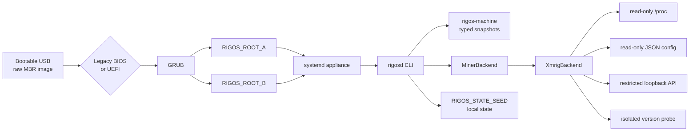

<p align="center">
  
</p>

<p align="center">
  
  
  
  
  
</p>

```text
RIGOS / LOCAL-FIRST CPU APPLIANCE
=================================

CPU-ONLY. POOL-NEUTRAL. USB-NATIVE.
NO ACCOUNT. NO ACTIVATION. NO CLOUD OWNER.
```

RIGOS is a local-first Linux mining operating system delivered as a bootable USB image.
It is built for explicit local ownership: the node boots, inspects, configures and mines
without requiring a RIGOS account or control-plane service.

```text
CURRENT PREVIEW : RIGOS 0.0.4-alpha.5
BOOT MEDIA      : raw MBR disk image
FIRMWARE        : Legacy BIOS + removable-media UEFI
RECOVERY        : stateless ISO
STATE           : local persistent partition
```

SYSTEM CONTRACT
---------------

```text
OS LICENSE COST:   0
WORKER LIMIT:      NONE
MONTHLY FEE:       0
CLOUD FEE:         0
RIGOS DEV FEE:     0
ACCOUNT REQUIRED:  NO
ACTIVATION:        NO
FORCED POOL:       NO
```

Electricity, Internet access, hardware, pool fees and third-party miner fees remain
external costs. RIGOS contains no billing, entitlement, activation, trial, balance,
payment-dependent miner control or remote kill-switch runtime.

DISK LAYOUT
-----------

```text
+----------------+----------------------+----------------------------+
| PARTITION      | ROLE                 | NOTES                      |
+----------------+----------------------+----------------------------+
| 1              | EFI_SYSTEM           | FAT32 / active             |
| 2              | RIGOS_ROOT_A         | primary appliance root     |
| 3              | RIGOS_ROOT_B         | alternate appliance root   |
| 4              | RIGOS_STATE_SEED     | local persistent state     |
+----------------+----------------------+----------------------------+
```

The recovery ISO is stateless and does not grow the state partition.

BOOT / CONTROL PATH
-------------------



ALPHA HISTORY
-------------

```text
0.0.4-alpha.1  GPT image failed Dell Legacy BIOS before GRUB
0.0.4-alpha.2  MBR image reached GRUB ROOT_A systemd and password setup
0.0.4-alpha.3  fixed console order but kept the first boot screen hidden
0.0.4-alpha.4  keeps the first boot screen on tty and captures answers separately
0.0.4-alpha.5  adds local rig profiles and portable XMRig Flight Sheets
```

Alpha five is isolated on its development branch. Alpha four physical-state
validation remains separate.

VERIFY
------

```bash
./scripts/verify.sh
```

LOCAL INSPECTION
----------------

```bash
cargo run -p rigosd -- machine inspect
cargo run -p rigosd -- machine inspect --json
cargo run -p rigosd -- miner inspect --json
cargo run -p rigosd -- doctor --json
```

DOCUMENTS
---------

- [Architecture](docs/architecture.md)
- [USB image build](docs/usb-image-build.md)
- [Product contract](docs/product-contract.md)
- [Pool contract](docs/pool-contract.md)
- [Release claims](docs/release-claims.md)
- [Physical evidence policy](docs/physical-validation-evidence.md)
