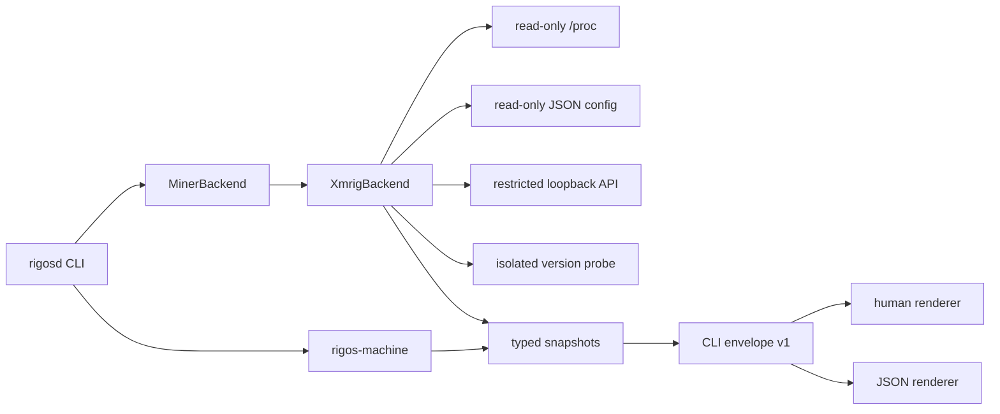

# v0.0.1 Architecture

Machine discovery is independent from miner-specific parsing. `InspectedProcessIdentity` provides identity only; lifecycle authority does not exist. `ProbeJobHandle` is the sole process-termination capability and can terminate only its own isolated probe group.

## Version boundary

- v0.0.1: observation and diagnostics
- v0.0.2: explicit local authority, lifecycle ownership, systemd integration, crash recovery and thermal FSM

