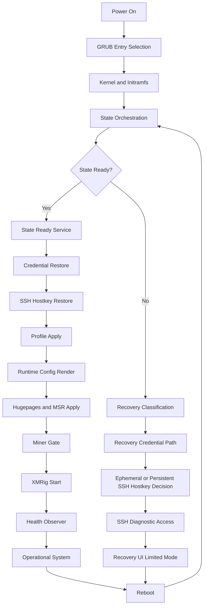

# RIGOS Finalization Plan

RIGOS is not ready to call final just because the Alpha.15 state path now works.
Alpha.15 is the functional baseline for persistence, SSH identity, and password
survival. The final release gate adds product boot polish, cross-hardware
compatibility, and repeated physical recovery evidence.

## Direction

Final means:

- boot presentation is intentional and readable;
- setup and recovery screens own the console without log corruption;
- persistent state survives repeated boots;
- admin password and SSH host keys persist when state is ready;
- recovery mode is explicit about what works and what is degraded;
- Intel and AMD machines either run with a supported policy or degrade clearly;
- miner startup is predictable and explainable.

## Workstreams

Keep these as separate branches or stacked changes. Do not fold them into the
Alpha.15 state transaction branch.

### Workstream 1 Boot polish

Scope:

- productize GRUB menu labels and ordering;
- set a quiet normal boot path with controlled diagnostic output;
- stop system logs from overwriting firstboot or recovery dialogs;
- enforce tty ownership and release discipline across firstboot, recovery, and getty;
- normalize firstboot and recovery screen flow and action labels;
- keep visual language consistent across setup and recovery.

Required checks:

- GRUB default entry is normal boot;
- safe and fallback entries are named for operators, not implementation details;
- firstboot and recovery use a known tty and release it deterministically;
- `StandardOutput`, `StandardError`, `TTYPath`, `TTYReset`, `TTYVHangup`, and
  `TTYVTDisallocate` behavior is intentional for each console unit;
- getty does not race or overwrite firstboot and recovery screens;
- systemd or service logs do not corrupt whiptail dialogs on tty1.

### Workstream 2 Hardware compatibility

Scope:

- add a native capability summary for Intel and AMD machines;
- detect vendor, model, logical CPUs, AES, RAM, huge-page support, MSR path,
  cpufreq state, and thermal sensor availability;
- derive runtime policy from capability tiers instead of one hardcoded profile;
- skip unsupported MSR or performance features without breaking boot or SSH diagnostics;
- explain degraded hardware paths in status and doctor output.

Initial tiers:

- `legacy-low-memory`;
- `legacy-2c4t`;
- `legacy-4c`;
- `modern-4cplus`;
- `aes-capable`;
- `no-aes`.

Policy outputs:

- XMRig thread count;
- huge-page request;
- RandomX suitability;
- MSR enable or skip decision;
- API bind policy;
- startup delay and health thresholds.

Required checks:

- Intel legacy machine boots and reports supported and skipped features clearly;
- AMD legacy machine boots and reports supported and skipped features clearly;
- no unsupported MSR path can block state, SSH, or recovery diagnostics;
- configured worker threads match the rendered XMRig runtime config;
- benchmark and production render paths use the same thread policy.

### Workstream 3 Final stability gates

Scope:

- keep state orchestration deterministic;
- verify admin password persistence across repeated reboots;
- verify SSH host key persistence across repeated reboots;
- preserve remote diagnostics in approved recovery paths;
- add a final acceptance script for state, credentials, SSH, and miner checks.

State classifications:

- `ready`;
- `missing`;
- `corrupt`;
- `repair_required`;
- `limited_capacity`;
- `identity_unavailable`;
- `mount_failed`.

Required checks:

- state partition is found by authoritative identity, not label-only discovery;
- fsck, resize, identity update, mount, and attestation are deterministic;
- dirty or partially repaired state resumes to a precise status;
- recovery mode reports credential scope accurately;
- if state is ready, persistent password and SSH host key are restored;
- if state is unavailable, fallback credential and host-key behavior is explicit.

## Product flow

### First boot

1. Welcome.
2. Flight sheet selection.
3. Admin password.
4. Network and SSH summary.
5. Confirmation.
6. Apply.
7. Done.

### Recovery mode

1. State problem summary.
2. What still works.
3. SSH access status.
4. Credential scope.
5. Continue to recovery shell, continue setup, or reboot.

No screen should require the operator to infer state from raw boot logs.

## Release checklist

### Boot UX

- [ ] GRUB labels are productized and consistent.
- [ ] No console log corruption appears over setup or recovery dialogs.
- [ ] Firstboot, recovery, and getty tty handoff is deterministic.
- [ ] Screen flow is consistent and readable.

### State

- [ ] State partition is identified reliably.
- [ ] fsck, resize, identity update, and mount are deterministic.
- [ ] Ready state survives multiple cold boots.
- [ ] Degraded state is classified precisely.

### Credentials

- [ ] Admin password persists across reboots.
- [ ] Recovery credential scope is accurately reported.
- [ ] Persistent credential restore is verified physically.

### SSH

- [ ] `ssh.service` is active in operational and approved recovery paths.
- [ ] Host key persists across reboots when state is ready.
- [ ] Host key fallback behavior is explicit when state is unavailable.

### Miner

- [ ] Runtime config is rendered deterministically.
- [ ] Huge-page status is correct.
- [ ] Thread policy matches the intended profile.
- [ ] Pool connectivity is stable.
- [ ] Accepted shares are observed physically.
- [ ] No unexpected restart loops occur.

### Hardware compatibility

- [ ] Intel legacy machine passes.
- [ ] AMD legacy machine passes.
- [ ] Skipped features are explained.
- [ ] Thermal reporting is available and truthful where sensors exist.

### Physical acceptance

- [ ] Fresh flash boot.
- [ ] Initial config.
- [ ] Reboot.
- [ ] Re-login.
- [ ] SSH verify.
- [ ] Miner verify.
- [ ] Reboot again.
- [ ] Persistence verify.

## Priority order

1. Fix boot log bleed and tty discipline.
2. Freeze state persistence path.
3. Freeze password and host-key persistence path.
4. Build Intel and AMD compatibility tiering.
5. Refine miner auto-policy.
6. Polish GRUB and firstboot visuals.
7. Run the final physical acceptance matrix.
8. Tag final only after the matrix passes.

## Runtime pipeline

