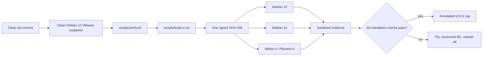

# v0.0.1 Release Pipeline

The authoritative RC is built from a clean commit inside a disposable VMware Debian 12 amd64 VM. Mining rigs validate that exact artifact; they never rebuild it.

## VMware build procedure

1. Restore a minimal Debian 12 amd64 snapshot containing Git, build-essential, binutils, ripgrep, ca-certificates and the pinned Rust toolchain.
2. Run `scripts/create-source-bundle.ps1 -Output <external-path>`, verify the generated SHA-256 inside the VM, and clone from the bundle.
3. Confirm `git status --porcelain` is empty and run `./scripts/build-rc.sh v0.0.1-rc2`.
4. Preserve the complete `dist/v0.0.1-rc2` directory. Every target must pass `sha256sum -c SHA256SUMS` before execution.

Any source, lockfile, schema, toolchain or build-script change invalidates the RC and all prior runtime evidence.
