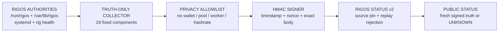

RIGOS STATUS AGENT
==================

VERSION
-------

    RIGOS IMAGE        0.0.4-alpha.26
    AGENT              2.0.1
    OBSERVATION        rigos.status-observation/v1
    COMPONENTS         19 EXACT ALLOWLISTED AUTHORITIES

PURPOSE
-------

The built-in status agent reads existing RIGOS authorities, constructs a
sanitized public observation and signs the exact JSON body for RigOS Status
v2.0.0. It does not change mining, configuration, recovery, state or health.

COLLECTOR SEMANTICS
-------------------

    root filesystem
        read-only roots are operational
        the expected Debian live overlay is operational when every lower layer
        is under /run/live/rootfs
        an unexpected writable root remains a major outage

    kernel integrity
        normal thermal-governor, thermal-zone and NMI-watchdog registration
        messages are ignored
        only bounded fault signatures are counted
        raw journal lines are never published

    time synchronization
        systemd-timesyncd is installed and enabled in the image
        NTPSynchronized=yes is operational
        NTPSynchronized=no remains degraded until synchronization completes

PERSISTENT FILES
----------------

    /var/lib/rigos/status-agent/config.env
    /var/lib/rigos/status-agent/ingest.secret
    /var/lib/rigos/status-agent/source-id
    /var/lib/rigos/status-agent/last-send.json

The image contains none of these files. The timer is disabled until explicit
operator configuration.

CONFIGURE
---------

    chmod 600 /root/rigos-status.secret

    sudo rig-status-agent configure \
        --server https://rigos.site \
        --secret-file /root/rigos-status.secret

    sudo rm -f /root/rigos-status.secret

OPERATE
-------

    sudo rig-status-agent status
    sudo rig-status-agent status --json
    sudo rig-status-agent collect
    sudo rig-status-agent send
    sudo rig-status-agent disable
    sudo rig-status-agent enable

FAILURE CONTRACT
----------------

    no configuration         timer disabled
    transport failure        exit 75, bounded observer result
    server rejection         exit 76, bounded observer result
    collector/integrity bug  exit 1, real service failure

Codes 75 and 76 are accepted by systemd through SuccessExitStatus. Status-plane
failure never blocks boot, state readiness, firstboot or mining.

PRIVACY CONTRACT
----------------

The observation excludes:

    wallet
    mining identity
    worker name
    pool address and status
    hashrate and shares
    hostname and IP address
    passwords and API tokens
    SSH private keys
    raw journal
    private runtime configuration

RELEASE LAW
-----------

Alpha.26 must not be tagged or described as stable until the exact source
commit has produced an exact image hash and the physical acceptance matrix has
passed against that artifact.
