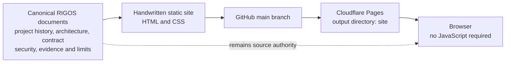

RIGOS SITE ARCHITECTURE
=======================

The website is a static projection of the repository record. It does not
replace the canonical engineering documents.


PUBLISHING PIPELINE
-------------------




RUNTIME BOUNDARY
----------------

```text
RIGOS appliance runtime   unchanged
RIGOS release source      unchanged
RIGOS canonical docs      unchanged
site                      read-only publication surface
Cloudflare Pages          publishes site after a main-branch push
```

The website contains no package manager, framework, static-site generator,
client JavaScript, analytics, remote font, CDN asset or build dependency.
