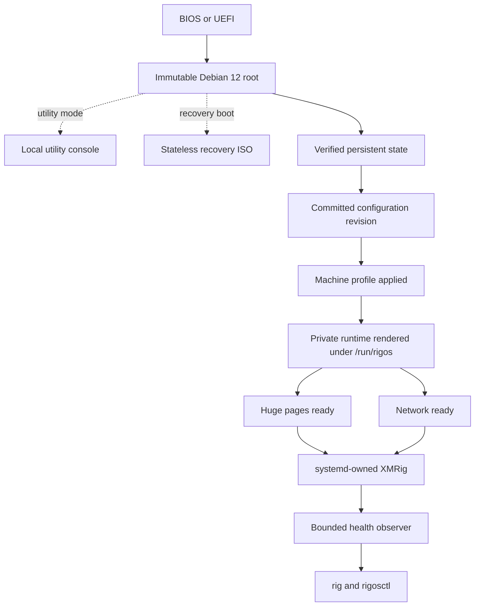
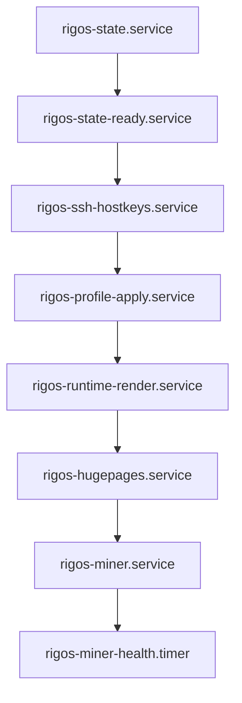
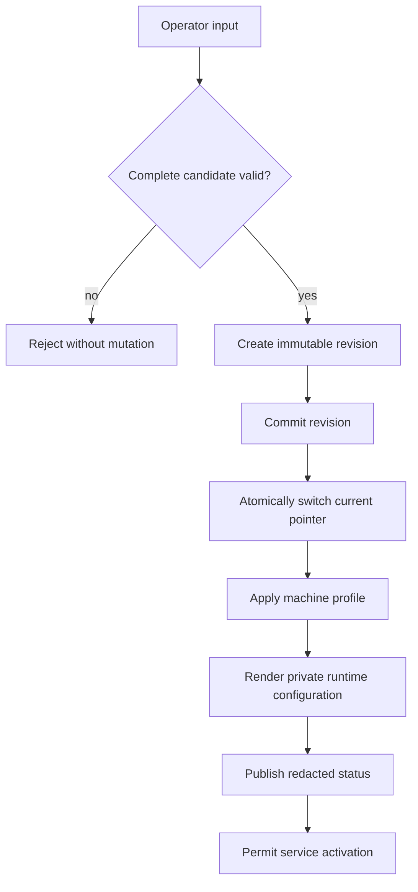

RIGOS MERMAID DIAGRAMS
=======================

These Mermaid blocks are the editable architecture source for the static SVG
figures published on the RIGOS website.

The browser does not execute Mermaid or JavaScript. The website serves checked-in
SVG files so the diagrams remain readable without a client runtime, package
manager, CDN or framework.


OPERATING PATH
--------------




SYSTEMD ORDERING
----------------




CONFIGURATION REVISION TRANSACTION
----------------------------------




STATIC PUBLICATION BOUNDARY
---------------------------

```text
site/DIAGRAMS.md              editable Mermaid source rendered by GitHub
site/diagrams/*.svg           static website figures
site/architecture.html        semantic text and figure references
browser JavaScript            none
runtime Mermaid dependency    none
```
